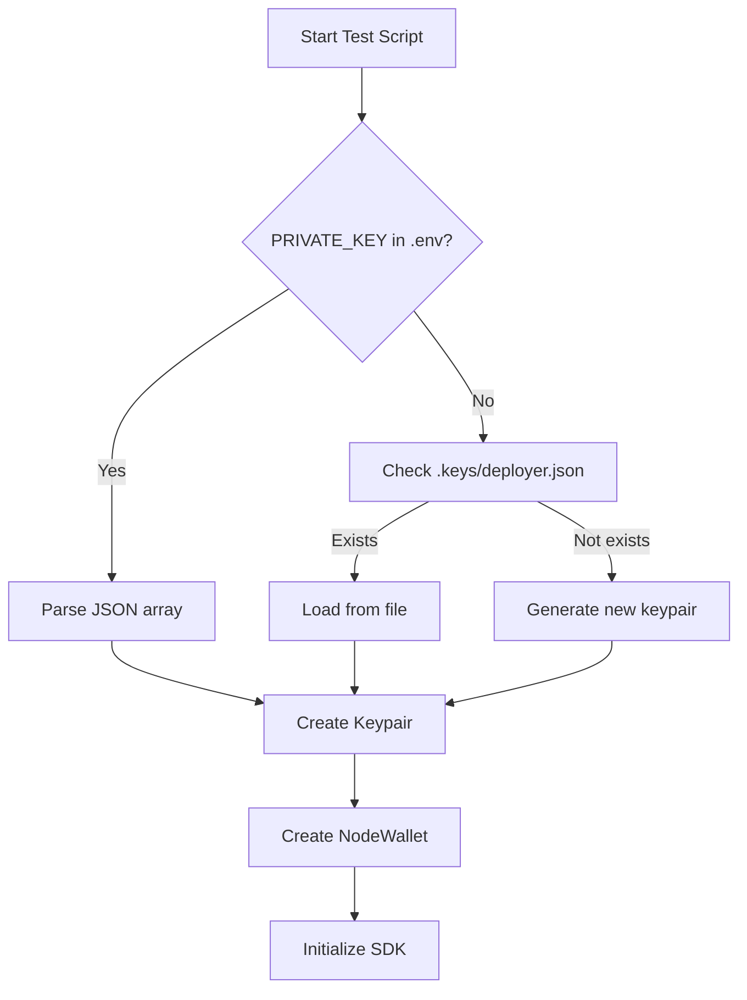

# Wallet Setup for Yoink SDK

## Overview
The SDK test scripts now use the same wallet as the smart contract tests, loaded from the `.env` file.

## Wallet Details

### Source
- **Original Location**: `~/.config/solana/id_pumpv2_deployer.json`
- **Public Key**: `715Zjd5g9kmUMBNBLDQWtbwqCptUrnCaebUfqkEK19rT`
- **Balance**: ~335.9 SOL (on Solana testnet)
- **Role**: Fee recipient wallet for the Yoink protocol

### Configuration Files

1. **`.env`** - Active configuration with complete private key
   - Contains the full keypair array
   - Used by test scripts automatically
   - ⚠️ **NEVER commit this file to git!**

2. **`.env.example`** - Template for other users
   - Contains placeholder values
   - Safe to commit to version control

3. **`.keys/deployer.json`** - Backup copy
   - Same keypair in JSON format
   - Alternative way to load the wallet

## Usage

### Method 1: Using .env file (Recommended)
The test scripts automatically load the wallet from `.env`:

```bash
# Read-only test
npm test

# Full transaction test
npm run test:tx
```

**Output shows:**
```
Using wallet from .env: 715Zjd5g9kmUMBNBLDQWtbwqCptUrnCaebUfqkEK19rT
Balance: 335.935130 SOL
```

### Method 2: Using .keys/ folder (Fallback)
If `PRIVATE_KEY` is not set in `.env`, scripts fall back to `.keys/deployer.json`

### Method 3: Manual keypair in code
```javascript
const fs = require('fs');
const { Keypair } = require('@solana/web3.js');

// Load from file
const secretKey = JSON.parse(fs.readFileSync('.keys/deployer.json', 'utf8'));
const keypair = Keypair.fromSecretKey(Uint8Array.from(secretKey));

console.log(keypair.publicKey.toBase58());
// Output: 715Zjd5g9kmUMBNBLDQWtbwqCptUrnCaebUfqkEK19rT
```

## Environment Variables

The `.env` file contains:

```bash
# RPC endpoint
# For testnet (current)
RPC_URL=https://staging-rpc.dev2.eclipsenetwork.xyz

# For Solana mainnet
# RPC_URL=https://api.mainnet-beta.solana.com

# Wallet private key (same as smart contract tests)
PRIVATE_KEY=[126,171,214,136,23,212,94,42,205,146,...]

# Program ID
PROGRAM_ID=HbiDw6U515iWwHQ4edjmceT24ST7akg7z5rhXRhBac4J

# Priority fees (optional)
PRIORITY_FEE_LAMPORTS=100000
PRIORITY_FEE_UNITS=200000
```

## Wallet Import Flow



## Security Notes

### ✅ Safe to commit
- `.env.example` - Template only
- `.gitignore` - Properly excludes secrets

### ⚠️ NEVER commit
- `.env` - Contains real private key
- `.keys/*.json` - Contains real keypairs

### Current .gitignore
```
.env
.keys/
node_modules/
dist/
```

## Verification

To verify the wallet is loaded correctly:

```bash
# Check public key matches
cd yoink-sdk
npm test | grep "Using wallet"

# Should show:
# Using wallet from .env: 715Zjd5g9kmUMBNBLDQWtbwqCptUrnCaebUfqkEK19rT
```

## Explorer Links

- **Wallet Address**: https://explorer.dev.eclipsenetwork.xyz/address/715Zjd5g9kmUMBNBLDQWtbwqCptUrnCaebUfqkEK19rT
- **Program ID**: https://explorer.dev.eclipsenetwork.xyz/address/HbiDw6U515iWwHQ4edjmceT24ST7akg7z5rhXRhBac4J

## Benefits

✅ **Consistency**: Same wallet across all tests (smart contract + SDK)
✅ **Funded**: Has 335+ SOL for testing transactions
✅ **Known**: This is the protocol fee recipient wallet
✅ **Traceable**: All test transactions link to the same address
✅ **Flexible**: Can use .env or .keys folder

## For Production Use

When using the SDK in production, create a new wallet:

```bash
# Generate new keypair
solana-keygen new --outfile ./my-wallet.json

# Fund it with SOL
solana airdrop 1 <YOUR_PUBLIC_KEY> --url https://staging-rpc.dev2.eclipsenetwork.xyz

# Add to .env
PRIVATE_KEY=[your,private,key,array,here]
```

Or use environment variables from your deployment platform (Vercel, AWS, etc.)
